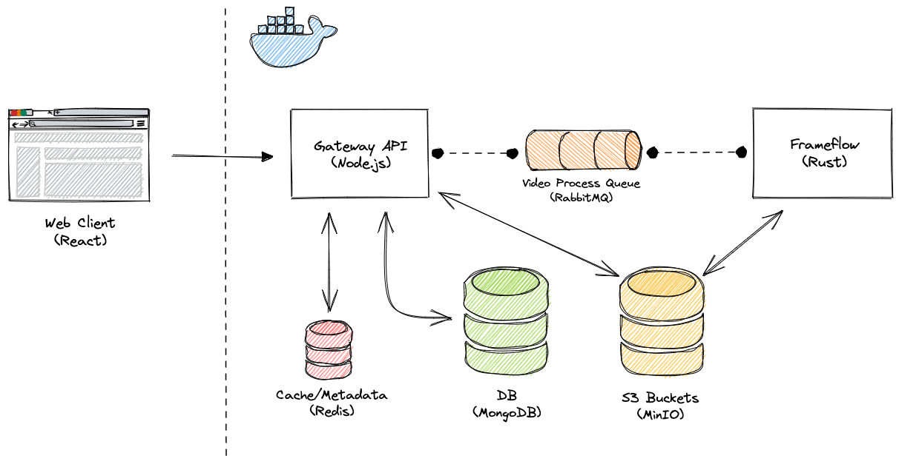

# Vidstream

An on-demand video streaming platform written in [Node.js](https://nodejs.org/en) and the [Rust](https://www.rust-lang.org/) programming language.

- Node.js (fastify)
- Rust
- MongoDB
- MinIO
- RabbitMQ
- Redis
- Solid.js

## Architecture

